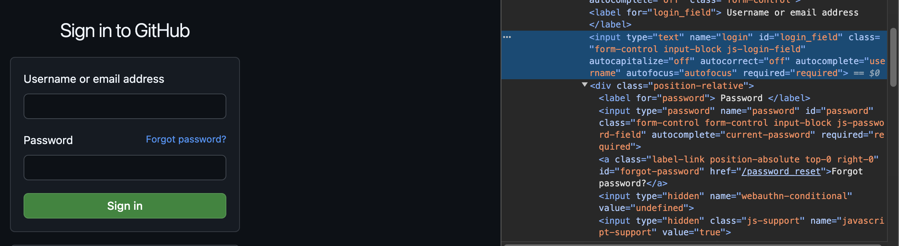

# Auto-Login bot
 Auto-login bot using Python Selenium library.
 Browser used: Chrome

## Pre-reqs:
1.  Install selenium using the below command:
''' pip install selenium
'''
2. Install chromedriver following the steps below:
    - Open Chrome -> Go to about and note the version of Chrome you have installed
    - Go to chromedriver [downloads] (https://developer.chrome.com/docs/chromedriver/downloads#chromedriver_1140573590)page
    - Go to [Chrome for Testing availability](https://googlechromelabs.github.io/chrome-for-testing/).This page usually has the latest version else to to [Version selection](https://developer.chrome.com/docs/chromedriver/downloads/version-selection) for older versions.
    - Under the stable table, navigate to chromedriver -> your PC's platform -> copy the URL path that holds the zip holder for chromedriver
    - Paste the URL in your browser and download
    - Unzip file and oberve that a chromedriver executable is in the directory
    - Copy the chromedriver executable and paste it in your usr/local/bin directory
    - On Mac or Linux, Got to folder /usr/local/bin and Paste the chromedriver there.
    - Double click to chromedriver to test. If you pop-up window stating that it's blocked, go to privacy and security settings on MacOS, scroll to security section and you should see chromedriver was blocked and click Run anyway. Then run chromedriver again.

## How to Run Bot:

1. Copy and save logIn-Bot.py locally on your PC.
2. Edit line 45 with the URL you want the bot to Auto-login.
3. Edit lines 40 and 41 with your usersame and password for URL in step 2.
4. Run logIn-Bot.py in the terminal.
'''
python3 logIn-Bot.py 
'''

## How to find ID element and NAME fields in Chrome
1. Open Chrome and navigate to log-in page of your choice.
2. Right-click on the field or button and select <strong>inspect.</strong>
3. The <strong>Element</strong> tab will open up on the right-hand side of the page in the Dev mode.
4. The seleced field  or button section will be hightlight.
5. Make note of the ID or NAME title. The snippet below is an exmaple of the ID title for the username field:
